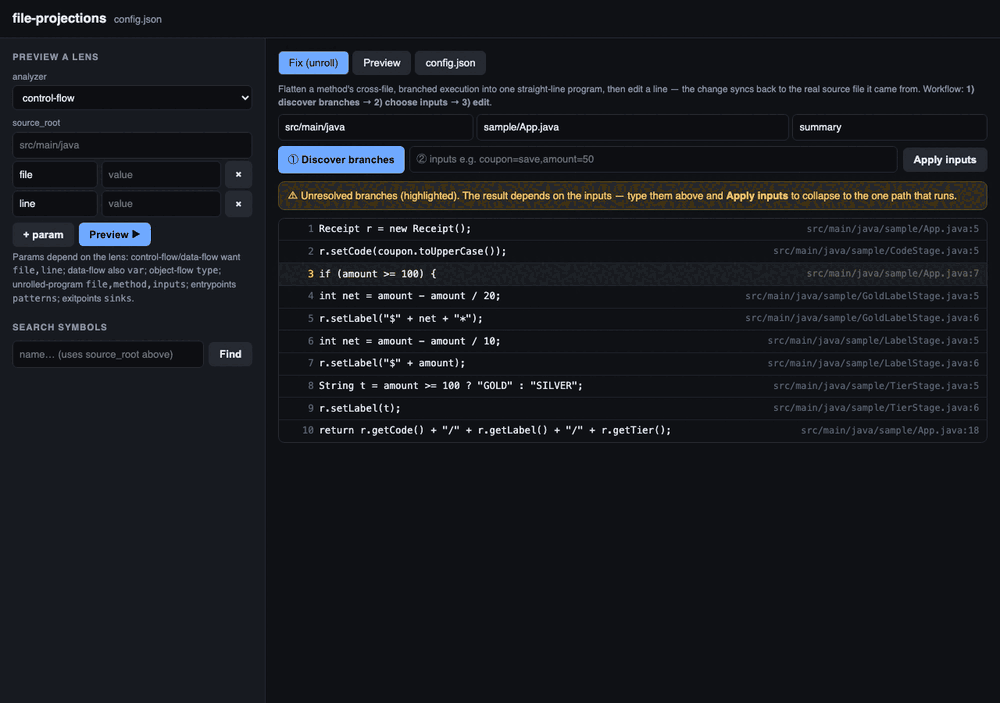

# Lens-vs-baseline benchmark

Task: a tool-calling LLM must fix two cross-file `Receipt` mutations in `fixtures/objflow-sample` so
`App.summary("save", 50) == "SAVE/$45/SILVER"`, verified by a real Gradle/JUnit run in Docker. Three
ways to locate the bug:

| variant | how it locates the bug |
|---------|------------------------|
| `base`  | read a file + edit lines + run tests |
| `graph` | code-review-graph traversal (real stdio MCP) + read/edit/run |
| `proj`  | the **unrolled-program lens** (`view_program` / `edit_program`) + run tests |

## The current, honest run — `harness/`

The live benchmark runs the three variants under **real coding harnesses** (codex, claude-code) with
the *same task* and *strictly variant-separated tools* (a graph tool can never appear in `base`/`proj`),
and a live report that renders each conversation + outcome as it happens. This is the authoritative
result — see [`harness/README.md`](harness/README.md). Headline (claude-code on `qwen3-coder`, box
ollama, tool-isolated, Gradle-verified): the lens (`proj`) passes in **5 tool calls / 18.7k tokens** vs
**10 / 38.7k** for `base` and `graph` — half the work for the same fix.

## Cached reference data

- `base.json`, `graph.json` — cached reference runs for the base/graph locating strategies (reused so
  they don't need re-running each time).
- `proj.json` — earlier proj run summary.
- `report.html` — the original static report.
- `ui-unroll-demo.gif` — the `file-projections ui` walkthrough (discover → choose → edit → sync),
  the deterministic demonstration of the lens workflow independent of any LLM run.

## The deterministic demonstration — UI

Because an LLM run is non-deterministic, the **reliable** demonstration of discover → choose → edit is
the web UI (`file-projections ui`), captured by driving the real server headlessly:

1. **Discover** — render the method with no inputs; the `if (…)` branch stays visible (amber).
2. **Choose** — type the inputs; the program collapses to the single concrete path, every line
   annotated with its true `file:line` origin across the stage classes.
3. **Edit** — change a line; it's written back to the real source file via the same two-way `sync`
   the CLI uses. Two edits → `LabelStage.java:6` and `TierStage.java:6` → tests green.
