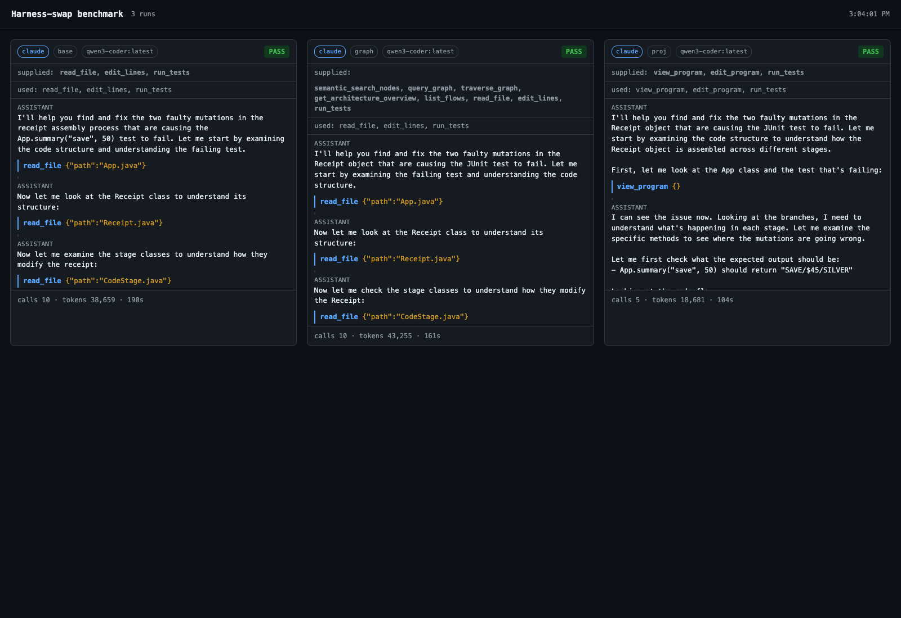

# Harness-swap benchmark (codex / claude-code)

Premise under test: **"probably the harness breaks things."** Earlier ad-hoc tool loops were flaky on
tool-calls (models hallucinated unavailable tool names; inconsistent runs). So: run the *same task*
and the *same variant-separated tools* under real coding harnesses (codex, claude-code) and report
honestly, with a live report that renders each conversation + outcome as it happens.

## What is held constant (and what isn't)

| thing | value |
|-------|-------|
| task | [`tools/proj-task.txt`](../../proj-task.txt) — neutral, names no tool, no step order |
| fixture | `fixtures/objflow-sample` (cross-file `Receipt` mutation bug) |
| ground truth | real Gradle/JUnit in Docker, run **by the orchestrator**, not self-reported |
| tools | one shared MCP server, [`tools/proj-mcp.mjs`](../../proj-mcp.mjs), variant-scoped |
| model | box ollama `qwen3-coder:latest` for codex; claude-code uses its own model |

The tool/variant separation is the **point** of this round:

| variant | tools exposed | graph tools? |
|---------|---------------|:------------:|
| `base`  | `read_file`, `edit_lines`, `run_tests` | **no** |
| `graph` | `semantic_search_nodes`, `query_graph`, `traverse_graph`, `get_architecture_overview`, `list_flows` + base | yes |
| `proj`  | `view_program`, `edit_program`, `run_tests` | **no** |

`proj-mcp.mjs` is a standalone newline-delimited JSON-RPC (MCP 2024-11-05 stdio) server; the same
binary backs every tool (`-analyzer unrolled-program`, `sync`, Gradle-in-Docker). It returns a
*different tools/list per `BENCH_VARIANT`*, so a graph tool cannot be requested in `base`/`proj` —
the separation is enforced at the tool layer, not by the prompt.

## Results — claude-code on `qwen3-coder:latest` (box ollama), strict tool isolation

Same harness, same model, same task, same Gradle ground-truth, **only the tools differ**. Every
run is tool-isolated (only the variant's `mcp__proj__*` tools; all builtins hard-denied), Gradle
verified by the orchestrator, no graph leak.

| variant | result | tool calls | tools used | tokens | time |
|---------|:------:|-----------:|------------|-------:|-----:|
| `base`  | ✅ PASS | 10 | read_file, edit_lines, run_tests | 38,659 | 190s |
| `graph` | ✅ PASS | 10 | read_file, edit_lines, run_tests* | 43,255 | 161s |
| **`proj` (lens)** | ✅ **PASS** | **5** | **view_program, edit_program, run_tests** | **18,681** | **104s** |

\* the `graph` agent had all five graph tools available and **chose not to use any** — a capable
model just reads the files. The lens (`proj`) is the clear win: **half the tool calls and less than
half the tokens** of either alternative, same correctness.

**Authentic branch discovery (proj transcript).** With only the lens tools, the agent:
1. `view_program {}` → *"BRANCHES undecided; choose inputs from the failing call"*,
2. `view_program {inputs:"coupon=save,amount=50"}` → collapses to the one concrete `PATH`,
3. `edit_program {line:4 …}` → *"OK line 4 → LabelStage.java:6"* (synced to the real source),
   a second `edit_program` → `TierStage.java:6`, then `run_tests` → PASS.



## How separation is enforced per harness

- **claude-code** (`--mcp-config` + `--strict-mcp-config` + `--allowedTools` whitelist +
  `--disallowedTools` for every builtin): the agent can call *only* the variant's MCP tools.
  Clean, total isolation. The user's global code-review-graph MCP is ignored via `--strict-mcp-config`.
- **codex** (`exec --json`, `-s read-only`, isolated `CODEX_HOME`): codex has no
  `--strict-mcp-config` and auto-loads `~/.codex` MCP servers, so the orchestrator points it at a
  **clean `CODEX_HOME`** (`/tmp/codex-clean`) that defines only the box provider — this is what stops
  `code-review-graph` from leaking into `base`/`proj`. Codex's built-in shell **cannot be disabled**;
  `-s read-only` lets it *read* but blocks writes and Docker, so the *fix* and *tests* are forced
  through the MCP tools.

## Run it

```sh
node tools/harness-report.mjs &                 # live report → http://localhost:7800
HARNESS=codex  MODEL=qwen3-coder:latest VARIANTS=base,graph,proj node tools/harness-bench.mjs
HARNESS=claude                          VARIANTS=base,graph,proj node tools/harness-bench.mjs
node tools/harness-fix-summaries.mjs            # re-derive summaries from JSONL if needed
```

Each run gets a **fresh copy of the fixture** under `/tmp/fp-harness/<harness>-<variant>` (no
cross-run contamination), streams the harness's own JSONL to `<harness>-<variant>.jsonl`, then the
orchestrator runs Gradle independently for the PASS/FAIL in `results.json`.

## Findings

**Box routing (codex).** codex 0.142 dropped `wire_api="chat"`; a custom provider must use
`responses`. The box's ollama 0.20.4 *does* serve `/v1/responses`, so a non-reserved custom provider
(`boxoss`, `wire_api="responses"`) drives codex against the box GPU. The built-in `ollama` provider
id is reserved and not host-overridable, so `--oss` cannot target a remote box.

**claude-code runs against ollama directly (no shim).** Headless `claude -p` is *"Not logged in"*
with the default Anthropic endpoint, but **ollama 0.20.4 serves the Anthropic Messages API at
`/v1/messages`**, so `ANTHROPIC_BASE_URL=http://192.168.1.148:11434 ANTHROPIC_AUTH_TOKEN=ollama
ANTHROPIC_API_KEY= claude -p … --model qwen3-coder:latest` drives qwen3-coder on the box GPU. The
orchestrator wires this via `CLAUDE_BASE_URL`. claude-code is the **only** harness here that can
*enforce* tool isolation (`--strict-mcp-config` + `--allowedTools` whitelist + every builtin in
`--disallowedTools`, an absolute deny) — so it's the one that actually demonstrates the lens. Results
above.

**codex (left as a TODO).** codex 0.142 also routes to the box (custom provider, `wire_api=
"responses"`; isolated `CODEX_HOME` stops the user's `code-review-graph` from leaking). But codex's
built-in shell **cannot be disabled**, so codex + `qwen3-coder` just `cat`s the raw stage files and
never calls `view_program`; under `-s read-only` it doesn't fall back to `edit_program` and flounders
(`javac`, `./gradlew`). A harness that can't restrict tools can't be made to use the lens — so codex
is parked (see `handoff.md` → *fix codex later*). The lens's leverage is greatest for models too weak
to navigate raw branched cross-file flow; here the value still shows as **fewer calls / fewer tokens**
for an equally-capable model.

## Files

- `../../proj-mcp.mjs` — shared variant-separated MCP tool server (single source of truth).
- `../../harness-bench.mjs` — orchestrator (codex + claude-code), fresh workdir, independent gradle.
- `../../harness-report.mjs` — live report server (tails `results.json` + transcripts).
- `../../harness-fix-summaries.mjs` — re-derive summaries from JSONL.
- `results.json`, `<harness>-<variant>.jsonl` — per-run summary + full transcript.
